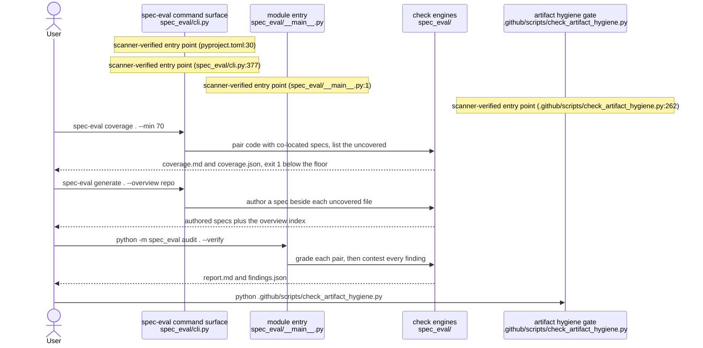
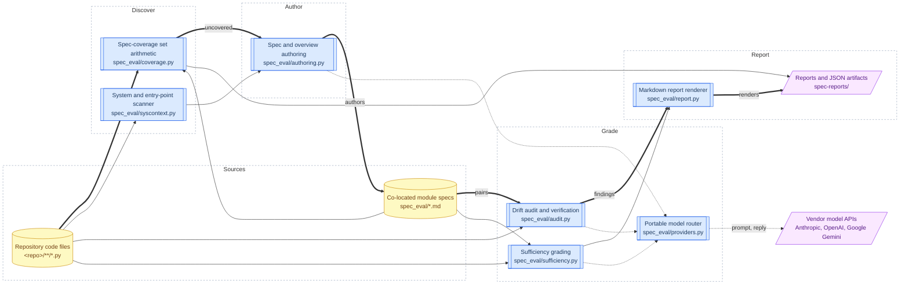

## What it is

**spec-eval** is a command-line trust-eval for the markdown specs that sit beside a codebase. From one surface it answers six questions: which spec-worthy code files have no governing spec (`coverage`), what external systems the code observably talks to (`context`), what the missing specs should say (`generate`), where code and spec contradict each other (`audit`), how completely a spec captures its code (`sufficiency`), and how the repo is invoked and how data moves through it (`diagram`). Two of those checks are pure filesystem arithmetic that need no API key; the other four ask a model and record exactly what it said. It optimizes for **verifiable trust over volume** — every reported row carries a `file:line` or a quoted line, and a check that cannot see something says so rather than guessing.

## Governing principles

- **A spec is a peer of the code, not a description of it.** Coverage, drift, and sufficiency all measure the code against the spec as an independent second source of truth.
- **Specs live beside the code.** A `model.md` next to `model.py` is the whole pairing convention; a pairs config is an option, never a prerequisite.
- **A missing spec and a wrong spec are different findings.** Coverage counts absence, audit counts contradiction, and the two never merge into one score.
- **Free checks must stay free.** `coverage` and `context` load no key and call no model, so they can run in CI on every commit.
- **Deterministic where a machine can decide, model-graded only where judgement is required.** The same tree always produces the same coverage percent and the same system inventory.
- **A missed finding beats a false one.** The drift rubric is deliberately conservative, and the verification pass may only withdraw a finding, never add one.
- **Every headline number is a faithful count of what follows it.** Caps, skips, partial views, and unscanned languages are stated on the surface; advisory heuristics never move a percentage or fail a gate.
- **Never invent evidence.** External systems and entry points are reported only where the deterministic scan observed them, each with a citable `file:line`.
- **Authored work is never silently destroyed.** An existing file at a target path is skipped unless the caller asks for an overwrite, and the working tree is the review surface.
- **Portable by construction.** The repo under inspection is always a path argument, every credential comes from the environment, and one model string routes to any supported vendor.

## Architecture (data flow)

### How it is invoked

### Data flow

Folded to fit the budget: the three observed vendor APIs are drawn as one boundary node, the drift rubric (`spec_eval/rubric.py`) and the verification pass (`spec_eval/verify.py`) are merged into their audit stage, every per-check markdown and JSON output is merged into one artifacts node, and the run log (`spec_eval/runlog.py`) is dropped as off the source-to-report path.

> The invocation entries and external systems are **scanner-derived** (`file:line`-observed) where noted; the internal edges are **inferred from the module intents, not verified against a call graph**.

## System context

| External system | Direction | What flows | Evidence |
|---|---|---|---|
| Anthropic API | outbound | Rubric plus code and spec text out; the drift, sufficiency, verification, or authoring reply back, with token counts | `spec_eval/providers.py:111` |
| Google Gemini API | outbound | The same prompts routed under a `google:` model spec; generated text and token counts back | `spec_eval/providers.py:129` |
| OpenAI API | outbound | The same prompts routed under an `openai:` model spec; generated text and token counts back | `spec_eval/providers.py:121` |

> Derived from this repository's code — rows are evidence of capability in the code, not proof of runtime traffic. Inbound callers and partner-system behavior are not observable from this repo — confirm asserted context with the owning teams.

## Module map

| Spec | Purpose |
|---|---|
| [`spec_eval/cli.md`](spec_eval/cli.md) | the command-line surface for the six checks, routing each to its engine and reporting the result. |
| [`spec_eval/coverage.md`](spec_eval/coverage.md) | coverage = the fraction of spec-worthy code files that have a governing spec, reported as a percent — pure filesystem set-arithmetic, no API key and no model call. |
| [`spec_eval/syscontext.md`](spec_eval/syscontext.md) | Deterministically inventory the external systems a repository's code observably talks to, with verifiable evidence per entry. |
| [`spec_eval/authoring.md`](spec_eval/authoring.md) | Author an intent-led spec for every spec-worthy file that lacks one, at the requested layout, plus the navigation overview that links them. |
| [`spec_eval/audit.md`](spec_eval/audit.md) | pair each code file with its doc, ask a model for contradictions, and return severity-tagged drift findings. |
| [`spec_eval/rubric.md`](spec_eval/rubric.md) | this module holds the fixed rubric that defines *drift* — a place where the code and its doc contradict each other; in a report these findings are **counted** (0 = clean). |
| [`spec_eval/verify.md`](spec_eval/verify.md) | re-read the document a drift finding was raised on and withdraw the finding if the document does not assert what it claims. |
| [`spec_eval/sufficiency.md`](spec_eval/sufficiency.md) | sufficiency = a per-pair completeness score from 0 to 1 — 1.0 = the code's behavior is fully rebuildable from the spec, 0 = the spec barely constrains the code. |
| [`spec_eval/report.md`](spec_eval/report.md) | render drift and sufficiency results into two markdown reports whose headline counts match their contents. |
| [`spec_eval/providers.md`](spec_eval/providers.md) | ask any supported vendor's model a question through one portable model string, with token usage tracked. |
| [`spec_eval/runlog.md`](spec_eval/runlog.md) | append one self-contained JSON line per completed check, stamped with the time and the repo's git SHA. |

## Glossary

- **Pair** — one unit of review: a code file or glob plus the spec meant to describe it, from an explicit config or the co-location convention (`spec_eval/audit.md` §2).
- **Spec-worthy** — a code file left after the exclusion tiers; the denominator of coverage (`spec_eval/coverage.md` §2).
- **Exclusion tier** — the class that makes a file impractical to spec, such as `test`, `generated`, `glue`, `config`, or `user` (`spec_eval/coverage.md` §2).
- **Coverage percent** — the fraction of spec-worthy files that have a governing spec, scoped to same-stem pairing (`spec_eval/coverage.md` §3).
- **Drift** — a real contradiction where the code does X and the doc claims Y (`spec_eval/rubric.md` §2).
- **Severity** — the reserved tier `high` / `medium` / `low`, chosen by what the doc claims rather than by reviewer feeling (`spec_eval/rubric.md` §3).
- **Class** — orthogonal to severity: `drift` is an unhonoured behavioural guarantee, `stale` is an outdated declarative value that is reported but not counted (`spec_eval/rubric.md` §3).
- **Drift load** — a pair's count of high and medium findings that the verification pass did not withdraw (`spec_eval/report.md` §2).
- **Withdrawal ground** — one of four named reasons a finding may be withdrawn, each settled by quoting a line that exists (`spec_eval/verify.md` §2).
- **Sufficiency** — a per-pair score in `0.0..1.0` for how completely the spec captures the code's behavior; an indicator, not a guarantee (`spec_eval/sufficiency.md` §2).
- **Gap** — one load-bearing behavior present in the code and absent from the spec, tagged `major` or `minor`, with a searchable `code_ref` (`spec_eval/sufficiency.md` §2).
- **Rationale masking** — blanking `**Why`-marked doc lines before the drift call, one line out per line in, so line references stay valid (`spec_eval/audit.md` §2).
- **Partial view** — the truncation notes a pair carries when an input hit its cap or a reply hit the token cap (`spec_eval/audit.md` §3).
- **Layout** — where an authored spec lands: `per-file`, `per-dir`, or `per-pair` (`spec_eval/authoring.md` §2).
- **Module intent** — a per-module spec, read or authored, that consolidated specs and diagrams are synthesised from instead of raw code (`spec_eval/authoring.md` §2).
- **Entry point** — one observed way the repo is invoked, tiered from a declared console script down to a bare `__main__` guard (`spec_eval/syscontext.md` §2).
- **Fingerprint stamp** — an HTML-comment receipt recording the scan a generated doc's claim came from, read back by `context --check` (`spec_eval/syscontext.md` §2).
- **Rebaseline** — a scan difference caused by the scanner learning to see more, absorbed instead of reported as drift (`spec_eval/syscontext.md` §2).
- **Orphan and unmodeled markdown** — advisory findings for a spec whose code is gone, and for markdown trees same-stem pairing cannot reach; neither moves the percentage (`spec_eval/coverage.md` §3).
- **Model spec** — a portable `provider:model` string, or `claude-code` for the key-free CLI bridge (`spec_eval/providers.md` §2).

## Health receipt

No scores live on this page. The spec-set trust signal — coverage, drift, and sufficiency, dated and pinned to a git SHA — lives in [`spec-reports/SPEC-HEALTH.md`](spec-reports/SPEC-HEALTH.md).

## Reading order

1. **This overview** — the project's job, the principles that govern it, and how a run moves from source files to reports.
2. **The module specs**, in the Module map order above: start with `cli.md` for the command surface, then the free checks (`coverage.md`, `syscontext.md`), then the model-graded ones (`authoring.md`, `audit.md` with `rubric.md` and `verify.md`, `sufficiency.md`), then the output layer (`report.md`, `providers.md`, `runlog.md`).
3. **[`spec-reports/SPEC-HEALTH.md`](spec-reports/SPEC-HEALTH.md)** — the dated, SHA-pinned evidence that these specs still match the code you just read about.

<!-- system-context-fingerprint: f829925b7eda -->

<!-- architecture-fingerprint: b70ae46731e0 -->
