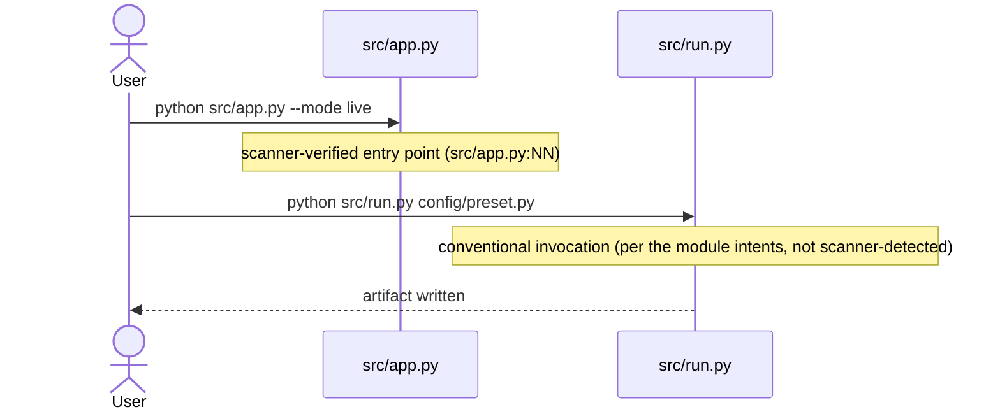
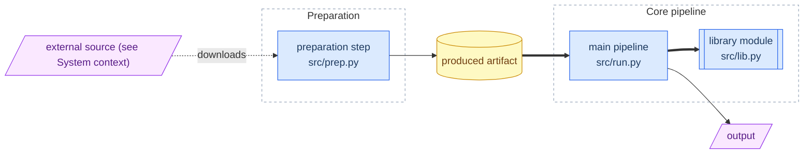

# `<project>` — Project Overview

> **About the TARGET project — not the process that specced it.**
> This page describes the *shape* of `<project>`; the specs describe the *contract*.
> If this page and a spec disagree, **the spec wins**. This page never restates a value — it points.

## What it is
<2–4 sentences: what `<project>` does, its core job, and what it optimizes for (clarity? speed? fidelity?).
Written so a newcomer understands the point before opening any spec.>

## Governing principles  *(the intent root — the "why" the whole set serves)*
- **<Principle 1>** — <one line>.
- **<Principle 2>** — <one line>.
<!-- If reverse-engineered: > Reconstructed intent (confidence: …) — inferred from the code, not stated by the author. -->

## Architecture (data flow)  *(repo overview only — per-directory READMEs omit this)*
<!-- The two diagrams go in this order: "How it is invoked" first, "Data flow" second — how the project is run,
     then what moves through it. -->

### How it is invoked

### Data flow

> The invocation entries and external systems are **scanner-derived** (`file:line`-observed) where noted; the internal edges are **inferred from the module intents, not verified against a call graph**.
<!-- ^ Copy that caveat line byte-for-byte: `spec-eval` emits the identical sentence, and a test pins the two together. -->

*(For internal component diagrams and stateful flows, see the relevant module spec's §3 Behavior.)*

## System context  *(the observed external seams — what `<project>` talks to)*
<!-- Scan first, then fill: run `spec-eval context` (or sweep the code for SDK/driver imports, connection-string
     schemes, literal URLs, endpoint-shaped env vars, and web-framework imports). Leaving this section out is
     what a scan that found nothing looks like — not a way to skip the scan. -->
| External system | Direction | What flows | Evidence |
|---|---|---|---|
| <AWS S3> | <outbound (infra)> | <domain-level payload, e.g. report artifacts> | <`src/store.py:41`> |
| <HTTP surface exposed (Flask)> | <inbound> | <callers: unknown from this repo> | <`src/api.py:12`> |

> Derived from this repository's code — rows are evidence of capability in the code, not proof of runtime traffic. Inbound callers and partner-system behavior are not observable from this repo — confirm asserted context with the owning teams. Systems and direction only: no installed-package lists, no endpoint schemas. A row needs code evidence you saw (`file:line`) — NEVER invent a row; when nothing was observed, omit this whole section.

## Module map  *(src → canonical spec → one-line intent; the navigation layer)*
| Module | Canonical spec | Intent (not signatures) |
|---|---|---|
| `<src/a.py>` | [a.md](./a.md) | <the spec's **In one line:** sentence, copied verbatim — not a paraphrase> |
| `<src/b.py>` | [b.md](./b.md) | <the spec's **In one line:** sentence, verbatim> |

## Glossary  *(plain-English one-liners, each → its spec section)*
- **<term>** — <meaning> → [<a.md §N>](./a.md)
- **<term>** — <meaning> → [<b.md §N>](./b.md)

## Health receipt
Spec-set trust signal (coverage / drift / sufficiency, dated + SHA-pinned): see
[SPEC-HEALTH.md](./spec-reports/SPEC-HEALTH.md). **This page carries no scores.**

## Reading order
1. This overview → 2. the module specs (`<a>` → `<b>` → …) → 3. [SPEC-HEALTH.md](./spec-reports/SPEC-HEALTH.md)
   to confirm the specs still match the code.
